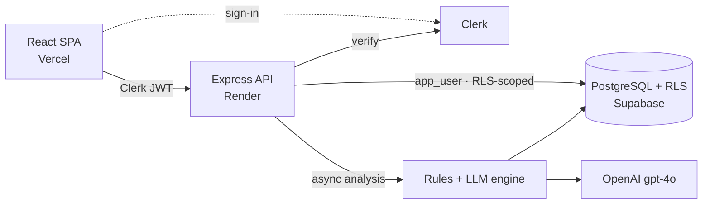

# FairHire

A bias-awareness tool for **hiring and promotion** decisions. FairHire analyses
interview transcripts to surface patterns of biased language — shifting
criteria, asymmetric concern, "culture fit" without evidence, age/energy
framing, and more — and reflects them back to managers as a personal review tool
(**Decision Companion**), a personal trend view (**Pattern Mirror**), and an
anonymised organisation-level view for HR (**HR Overview**).

Built for Singapore's investment-banking context, with demographic dimensions
specific to the local workforce.

> **The trust contract:** a manager sees only their own interviews and patterns.
> HR sees only anonymised, organisation-level aggregates — never an individual
> manager's data. This isn't a policy; it's enforced at the database layer and
> proven by tests. See **[docs/SECURITY.md](./docs/SECURITY.md)**.

---

## Documentation

| Doc | What's inside |
|---|---|
| **[Architecture](./docs/ARCHITECTURE.md)** | Monorepo layout, data flow, modes, the three surfaces, data model, full API reference |
| **[Security & privacy](./docs/SECURITY.md)** | RLS model, `withManagerContext`, the policy matrix, why `SECURITY DEFINER` beats plain RLS, how isolation is proven |
| **[Analysis engine](./docs/ANALYSIS.md)** | The hybrid rules + LLM pipeline, run lifecycle, flag types, confidence & severity scoring |
| **[Evaluation](./docs/EVALUATION.md)** | Precision/recall/F1 methodology, ground truth, matching, fairness breakdown, limitations |

---

## Architecture at a glance



A React SPA authenticates with Clerk and calls an Express API. The API scopes
every query to the signed-in manager via Postgres Row-Level Security. Transcript
analysis runs asynchronously (a deterministic rules engine + an LLM) and writes
flags back to the database. Full detail in
[docs/ARCHITECTURE.md](./docs/ARCHITECTURE.md).

## Tech stack

| Layer | Technology |
|---|---|
| Frontend | React, Vite, TypeScript, React Router, TanStack Query, TipTap, Tailwind |
| Backend | Node.js, Express, TypeScript |
| ORM / DB | Prisma over PostgreSQL (Supabase) with Row-Level Security |
| Auth | Clerk |
| LLM | OpenAI (`gpt-4o`) |
| Testing | Jest + supertest (api), Vitest + Testing Library (web) |
| CI / Deploy | GitHub Actions · Vercel (web) · Render (api) |

---

## Quickstart

**Prerequisites:** Node.js ≥ 20, a [Supabase](https://supabase.com) project
(pooled + direct connection strings), a [Clerk](https://clerk.com) app, and an
OpenAI API key (optional — analysis degrades to rules-only without it).

```bash
# 1. Install
npm install

# 2. Configure — copy the template and fill in every value
cp .env.example .env
npm run check-env        # validates required vars

# 3. Migrate the schema
npm run db:migrate

# 4. Apply Row-Level Security (once per Supabase project)
#    Run prisma/manual/001–005 in the Supabase SQL editor, in order.
#    Each file has instructions at the top. This creates the app_user role,
#    the RLS policies, and the HR aggregate functions.

# 5. Seed synthetic data (destructive)
npm run seed:reset

# 6. Run the dev servers (two terminals)
npm run dev:api          # http://localhost:3001
npm run dev:web          # http://localhost:5173
```

> **Note:** after RLS is applied, `DATABASE_URL` must connect as `app_user`
> (RLS-enforced). `DIRECT_URL` stays the superuser connection used by migrations
> and the seed script. This split is the foundation of the privacy model —
> [docs/SECURITY.md](./docs/SECURITY.md).

---

## Environment variables

All variables live in `.env.example`. Summary:

| Variable | Where | Description |
|---|---|---|
| `DATABASE_URL` | api | Supabase **pooled** string. Connects as `app_user` after RLS setup. |
| `DIRECT_URL` | api, scripts | Supabase **direct** string. Superuser — migrations + seed (RLS-bypass). |
| `CLERK_SECRET_KEY` | api | Clerk backend secret. |
| `CLERK_PUBLISHABLE_KEY` | api | Clerk publishable key (required by `@clerk/express`). |
| `VITE_CLERK_PUBLISHABLE_KEY` | web | Same value; `VITE_` prefix exposes it to the browser. |
| `VITE_API_BASE_URL` | web | API base URL (e.g. `http://localhost:3001` in dev). |
| `WEB_URL` | api | Allowed browser origin(s) for CORS (comma-separated). |
| `INTERNAL_API_SECRET` | api | Shared secret for `POST /internal/*`. Generate with `openssl rand -hex 32`. |
| `OPENAI_API_KEY` | api | Enables the LLM analysis layer. Without it, analysis is rules-only. |
| `OPENAI_MODEL` | api | Optional; defaults to `gpt-4o-2024-08-06`. |
| `WEB_ORIGIN_REGEX` | api | Optional; overrides the default Vercel preview-URL CORS pattern. |

---

## Scripts

| Script | Description |
|---|---|
| `npm run dev:web` / `npm run dev:api` | Start the Vite / API dev servers |
| `npm run build` | Build all workspaces (shared → api → web) |
| `npm run type-check` | `tsc --noEmit` across all workspaces |
| `npm run lint` | ESLint across the repo |
| `npm test --workspace=api` | API test suite (Jest) |
| `npm test --workspace=web` | Web test suite (Vitest) |
| `npm run eval` | Run the analysis eval harness ([docs](./docs/EVALUATION.md)) |
| `npm run seed:reset` | Destructive reseed with synthetic data |
| `npm run check-env` | Validate required env vars |
| `npm run db:migrate` / `db:generate` / `db:studio` | Prisma migrate / client / studio |

---

## Testing

```bash
npm test --workspace=api    # 268 tests (mock-based; no DB needed)
npm test --workspace=web    # 80 tests
```

The default API suite mocks Clerk and Prisma, so it needs no database. RLS
correctness is validated by two **opt-in integration suites** that run against a
live RLS-applied database:

```bash
# apply prisma/manual/001–005 + seed, then:
INTEGRATION=1 npm test --workspace=api
```

These add adversarial cross-tenant isolation tests and a policy-coverage matrix
that asserts every table's exact RLS command set. See
[docs/SECURITY.md → How it's proven](./docs/SECURITY.md#how-its-proven).

---

## Seed data

`npm run seed:reset` builds a synthetic organisation — **Meridian Capital
Partners** — with 6 divisions, 5 managers (incl. one HR admin), 10 candidates, 12
meetings, and 31 flags. The transcripts contain deliberate, distinct bias
patterns (e.g. communication concerns concentrated on some groups, "culture fit"
hedging, age/energy framing) so the [eval harness](./docs/EVALUATION.md) has
ground truth to score against, plus a clean control case.

All names and data are fictional.

---

## Deployment

- **Frontend (Vercel):** `vercel.json` at the root configures the build. Set
  `VITE_CLERK_PUBLISHABLE_KEY` and `VITE_API_BASE_URL`.
- **Backend (Render):** `render.yaml` defines the service (build runs
  `prisma generate`). Set `DATABASE_URL`, `DIRECT_URL`, `CLERK_SECRET_KEY`,
  `CLERK_PUBLISHABLE_KEY`, `INTERNAL_API_SECRET`, `WEB_URL`, and `OPENAI_API_KEY`.

RLS SQL (`prisma/manual/001–005`) is applied once per Supabase project via the
SQL editor — it is not part of the automated build.
