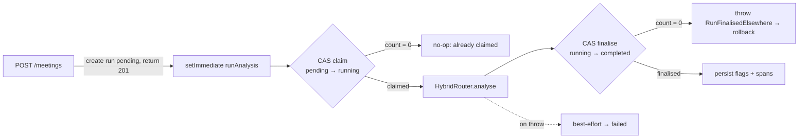

# The analysis engine

FairHire turns an interview transcript into a set of **flags** — specific spans
of language that may reflect bias — each with a type, an excerpt, a reasoning
line, and a confidence score. Analysis is a **hybrid** of a deterministic rules
engine and an LLM, run asynchronously off the request path.

- [Run lifecycle](#run-lifecycle)
- [The hybrid router](#the-hybrid-router)
- [Rules engine](#rules-engine)
- [LLM analyser](#llm-analyser)
- [Flag types](#flag-types)
- [Confidence & severity](#confidence--severity)

---

## Run lifecycle

Analysis is scheduled when a meeting is created and tracked by an `AnalysisRun`
row. The status enum has **four** states — `pending → running → completed |
failed` (see [`schema.prisma`](../prisma/schema.prisma)). There is deliberately
**no `degraded` status**; see [Confidence & severity](#confidence--severity) for
what "rules-only" actually is.



The mechanics, in [`api/src/analysis/analyseTranscript.ts`](../api/src/analysis/analyseTranscript.ts):

1. **Schedule.** `POST /meetings` creates the meeting + a `pending` `AnalysisRun`
   in one transaction, returns `201`, then kicks off `runAnalysis(runId)` via
   `setImmediate` so analysis never blocks the response.
2. **Claim.** `runAnalysis` loads the run with `systemPrisma` (a background job
   has no manager context), then does a compare-and-set:
   `updateMany({ where: { id, status: 'pending' }, data: { status: 'running' }})`.
   If `count === 0` it no-ops — this is what prevents a double-run producing
   duplicate flags.
3. **Analyse & finalise.** It runs the router, then transitions
   `running → completed` with another CAS. If that `count === 0`, another path
   already finalised the run, so it throws `RunFinalisedElsewhere` to roll back.
4. **Persist.** Flags are written through the shared `persistFlagWithSpans`
   helper, which computes verbatim character offsets for each excerpt so the UI
   can highlight the exact span. (An LLM excerpt that isn't verbatim in the
   transcript yields a flag with zero spans — shown in the gutter only.)

**Re-run.** `POST /meetings/:id/analyse` guards against an already-active run,
deletes existing flags (spans cascade), creates a fresh `pending` run, and
returns `202`. This backs the "Re-run analysis" button in the flag review UI.

**The `/internal` callback.**
[`POST /internal/analysis/:runId/results`](../api/src/routes/internal.ts) is a
real, secret-authenticated route (`x-internal-secret`, not Clerk) that lets an
*external* analysis worker post results. It shares the same `persistFlagWithSpans`
helper and the same CAS-finalise guard as the in-process path. Today the
in-process `runAnalysis` path is the only producer; the endpoint exists for a
future/external engine.

---

## The hybrid router

[`HybridRouter`](../api/src/analysis/HybridRouter.ts) is a **run-both-and-merge**
design, not a conditional dispatcher. `analyse(transcript, meetingType)` always
runs *both* the rules engine and the LLM analyser, then merges:

```ts
const ruleFlags = this.rulesEngine.run(transcript, meetingType);
const { flags: llmFlags, ok: llmOk } = await this.llmAnalyser.analyse(transcript, meetingType);
return { flags: deduplicate(ruleFlags, llmFlags), llmOk };
```

"Rules-only" output is therefore an *emergent* outcome, not a routing choice:
when the LLM fails it returns an empty flag list (`ok: false`), so the merged
result is simply the rule flags.

**Dedup/merge.** `deduplicate` starts from the rule flags and folds in each LLM
flag: if no existing flag has the **same type** and an **overlapping excerpt**,
it's appended; if one does, the **higher-confidence** flag wins. Overlap requires
containment (one excerpt includes the other, case-insensitive) *and* a length
ratio ≥ `0.5`, so a short rule match and a long LLM sentence about the same
phrase collapse into one flag rather than two.

---

## Rules engine

Rules are deterministic, phrase-based detectors — fast, free, and reliable for
known patterns. The base [`Rule`](../api/src/analysis/rules/Rule.ts) class holds
a list of `PhraseEntry { pattern, confidence, reasoning, suggestedAlt? }`; its
`match()` finds each phrase, extracts the containing sentence as the excerpt, and
dedupes by excerpt keeping the highest-confidence entry.

Rules are **mode-aware** — `getRulesForMode(meetingType)` in
[`rules/index.ts`](../api/src/analysis/rules/index.ts) selects one of two
disjoint sets, so hiring rules never fire on promotion meetings and vice-versa:

| Mode | Rule class | Flag type |
|---|---|---|
| Hiring | `AsymmetricConcernRule` | `asymmetric_concern` |
| Hiring | `HedgingLanguageRule` | `hedging_language` |
| Hiring | `AgeBiasRule` | `age_bias` |
| Hiring | `CriteriaDriftRule` | `criteria_drift` |
| Promotion | `PotentialVsPerformanceRule` | `potential_vs_performance` |
| Promotion | `TenureFramingRule` | `tenure_framing` |
| Promotion | `PeerComparisonBiasRule` | `peer_comparison_bias` |
| Promotion | `ConfidenceProxyRule` | `confidence_proxy` |

Note `biased_language` has **no rule class** — it is detected by the LLM only.
`CriteriaDriftRule` intentionally uses a lower confidence band because true
cross-candidate drift needs the LLM's context.

---

## LLM analyser

[`LLMAnalyser`](../api/src/analysis/llm/LLMAnalyser.ts) catches the open-ended
cases rules can't. Details:

- **Model:** OpenAI `gpt-4o-2024-08-06` (override via `OPENAI_MODEL`), called with
  `temperature: 0.1`, `response_format: { type: 'json_object' }`, and a 60s
  timeout.
- **Prompt:** mode-specific ([`prompt.ts`](../api/src/analysis/llm/prompt.ts)) —
  a 5-type taxonomy for hiring, a 4-type taxonomy for promotion — framed for the
  Singapore investment-banking context. Shared scoring guidance tells the model
  to omit any flag it is less than 0.5 confident in.
- **Validation:** the response is `JSON.parse`d and checked against a Zod schema
  (`{ flags: FlagCandidate[] }`). On a parse failure it does **one** repair retry
  with an appended "return valid JSON" reminder.
- **Failure = honest empty.** Any API error, timeout, or unparseable-after-retry
  response returns `{ flags: [], ok: false }`. `ok: false` means "the LLM did not
  run," *not* "found nothing" — that distinction drives the degraded note.
- **Privacy:** transcripts and model responses are never raw-logged; only a
  length + SHA-256 fingerprint is logged, so PII stays out of logs.

---

## Flag types

Nine flag types across the two modes. Labels come from `FLAG_TYPE_LABELS` and the
one-line explainers from `FLAG_TYPE_EXPLAINERS`, both in
[`shared/src/`](../shared/src/) (single source of truth, reused by the UI and
these docs).

| Type | Label | What it looks for |
|---|---|---|
| `biased_language` | Biased language | Wording that carries a stereotype or loaded assumption about a group. |
| `criteria_drift` | Shifting criteria | A standard introduced for this candidate that wasn't applied to others. |
| `asymmetric_concern` | Asymmetric concern | A concern raised for this candidate that comparable candidates didn't get. |
| `hedging_language` | "Culture fit" without evidence | A "culture/team fit" doubt stated without specific behavioural evidence. |
| `age_bias` | Energy / pace language | Energy / pace / "career stage" language that can stand in for age. |
| `potential_vs_performance` | Potential vs performance | Rewarding perceived potential over demonstrated, evidenced work. |
| `tenure_framing` | Tenure framing | Treating time-in-seat as if it were contribution or readiness. |
| `peer_comparison_bias` | Peer-comparison bias | Judging against one named peer rather than the level's rubric. |
| `confidence_proxy` | Confidence proxy | "Needs more presence/assertiveness" framing that can proxy for protected traits. |

The first five are hiring-mode; the last four are promotion-mode.

---

## Confidence & severity

Every flag carries a `confidenceScore` in `[0, 1]`, but the two sources produce
it differently:

- **Rule flags** use fixed, hand-authored confidences baked into each phrase
  (observed range ≈ 0.72–0.95). They are not subject to any floor — a rule only
  fires on a curated phrase, so its confidence is a deliberate authoring choice.
- **LLM flags** carry the model's own 0–1 score. These pass through a floor:
  `MIN_LLM_CONFIDENCE = 0.5`, enforced by `enforceConfidenceFloor`, which drops
  only the offending entries (a flag at exactly 0.5 is kept) rather than
  rejecting the whole batch. The schema stays lenient on purpose so one
  low-confidence entry can't fail validation and trigger the fallback path; the
  0.5 rule is re-applied here as a business rule.

**Severity** is a plain band over confidence, defined once in
[`web/src/lib/severity.ts`](../web/src/lib/severity.ts):

| Severity | Confidence |
|---|---|
| High | ≥ 0.75 |
| Med | 0.50 – 0.75 |
| Low | < 0.50 |

Because LLM flags are floored at 0.5, they are never "Low" — a "Low" flag can
only come from a rule whose confidence sits in `[0.50, 0.75)`. Severity is a
band of *confidence*, not a claim about how harmful the language is, and a flag
is a prompt to look again — not a verdict.

See **[EVALUATION.md](./EVALUATION.md)** for how flag quality is measured against
labelled data.
