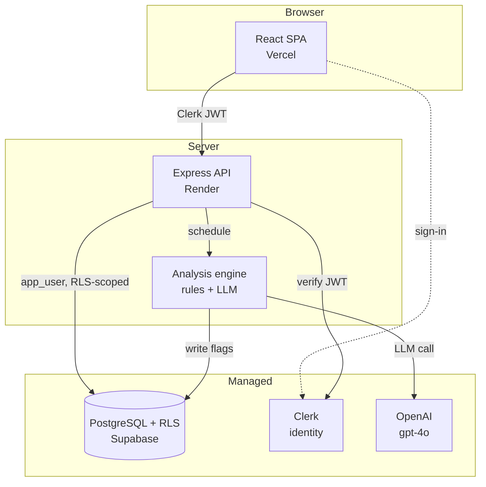

# Architecture

FairHire is a TypeScript monorepo: a React SPA, an Express API, and a shared
types package, over a PostgreSQL database with Row-Level Security.

- [Monorepo layout](#monorepo-layout)
- [System diagram](#system-diagram)
- [Request & analysis data flow](#request--analysis-data-flow)
- [Modes: Hiring & Promotion](#modes-hiring--promotion)
- [The three surfaces](#the-three-surfaces)
- [Data model](#data-model)
- [API reference](#api-reference)

---

## Monorepo layout

```
fairhire/
  web/        React + Vite + TypeScript SPA          — deployed on Vercel
  api/        Node.js + Express + TypeScript API      — deployed on Render
  shared/     Zod-first shared types                  — consumed by web and api
  prisma/     schema.prisma + migrations + manual RLS SQL (001–005)
  scripts/    seed.ts, check-env.ts, check-rls.ts, eval runner
  docs/        this documentation
```

`shared/` is the single source of truth for cross-cutting vocabulary — flag
types, meeting modes, decision outcomes, period keys, and their display labels —
so the client and server can't drift. It is built to `dist/` and imported as
`@fairhire/shared` by both other packages.

---

## System diagram



The web app authenticates with Clerk and calls the API with the resulting JWT.
The API verifies the token, resolves the caller's `Manager` row, and scopes every
query to that manager (see **[SECURITY.md](./SECURITY.md)**). Analysis runs
asynchronously on the server and writes flags back to the database.

---

## Request & analysis data flow

1. **Sign in.** The manager signs in via Clerk. On first login the SPA calls
   `POST /auth/sync`, which creates their `Manager` row (demo-only role
   self-select); thereafter `GET /auth/me` returns their profile and role.
2. **Upload.** The manager uploads an interview transcript (`POST /meetings`),
   choosing Hiring or Promotion mode. The API stores the meeting and a `pending`
   `AnalysisRun`, returns immediately, and schedules analysis off the request
   path.
3. **Analyse.** The engine runs the rules + LLM hybrid and writes `Flag` rows.
   The status transitions `pending → running → completed | failed`. Full detail
   in **[ANALYSIS.md](./ANALYSIS.md)**.
4. **Review.** The manager opens the **Decision Companion** for that meeting —
   the transcript with flags highlighted inline — reviews each flag, optionally
   dismisses some with a reason, and records a decision.
5. **Reflect.** The **Pattern Mirror** shows that manager's own cross-meeting
   trends and nudges over a selectable period.
6. **Aggregate.** An HR admin sees the **HR Overview** — org-level anonymised
   aggregates and org-level nudges — never any individual manager's data.

---

## Modes: Hiring & Promotion

Every meeting has a `meetingType` of `hiring` or `promotion` (`MEETING_TYPES` in
`shared/`). The mode is a first-class axis that branches:

- **Rule selection** — disjoint hiring vs promotion rulesets.
- **The LLM prompt** — a different bias taxonomy per mode.
- **Decision outcomes** — hiring offers `hired / rejected / in_progress`;
  promotion offers `promoted / held / in_progress`.
- **The UI** — the decision panel's buttons and the Pattern Mirror's framing.

---

## The three surfaces

| Surface | Who | What it shows |
|---|---|---|
| **Decision Companion** | Manager | Per-meeting flag review: transcript with highlighted spans, each flag's excerpt/reasoning/confidence/severity, dismissal, and the decision panel. |
| **Pattern Mirror** | Manager | That manager's *own* cross-meeting trends over a period — flag categories, decision distribution, demographic pipeline, and personal nudges. |
| **HR Overview** | HR admin | Organisation-level, anonymised aggregates + org-level nudges. No individual manager, candidate, or excerpt. |

The manager surfaces are strictly self-scoped by RLS; the HR surface reads only
the `SECURITY DEFINER` aggregate functions. See **[SECURITY.md](./SECURITY.md)**.

---

## Data model

Eleven tables, all under Row-Level Security. Key entities:

- **Organisation / Department** — tenant + division. Read-only reference data.
- **Manager** — linked to a Clerk user ID; `role` is `manager` or `hr_admin`;
  belongs to an org + department.
- **Candidate / CandidateDemographics** — the person and their (separately
  tabled) Singapore-specific demographics: race, gender, age band, nationality
  status, first language.
- **Meeting** — the interview; holds the raw transcript and the `meetingType`.
- **MeetingCandidate** — join table linking meetings to candidates.
- **Decision** — outcome per candidate per meeting.
- **Flag** — a detected bias signal: type, excerpt, reasoning, confidence,
  optional suggested alternative, dismissal state.
- **FlagSpan** — verbatim character offsets of a flag's excerpt in the transcript
  (drives inline highlighting).
- **AnalysisRun** — the status/lifecycle record for each analysis job.

The full schema is in [`prisma/schema.prisma`](../prisma/schema.prisma); the RLS
policies that protect these tables are in
[`prisma/manual/001`–`005`](../prisma/manual/).

---

## API reference

All routes require a valid Clerk JWT **and** a corresponding `Manager` row except
`/health`, `POST /auth/sync` (JWT only, no Manager yet), and `/internal/*` (shared
secret). "Owner" means the route additionally passes `requireOwnership(...)`;
`/hr/*` additionally passes `requireRole('hr_admin')`.

| Method | Path | Auth | Description |
|---|---|---|---|
| `GET` | `/health` | none | Health check |
| `POST` | `/auth/sync` | Clerk JWT | Upsert `Manager` on first login |
| `GET` | `/auth/me` | Manager | Current manager profile + role |
| `PATCH` | `/auth/me` | Manager | Change own division (`deptId` only — never role) |
| `GET` | `/auth/departments` | Manager | Org-scoped division list |
| `GET` | `/meetings` | Manager | List own meetings |
| `POST` | `/meetings` | Manager | Create meeting + schedule analysis |
| `GET` | `/meetings/:id` | Manager (owner) | Meeting with flags + latest run |
| `POST` | `/meetings/:id/analyse` | Manager (owner) | Re-run analysis (wipes prior flags) |
| `GET` | `/candidates` | Manager | Org candidate roster (+ org-wide flag counts) |
| `POST` | `/candidates` | Manager | Create a candidate |
| `PATCH` | `/candidates/:id` | Manager (owner) | Update candidate / demographics |
| `DELETE` | `/candidates/:id` | Manager (owner) | Soft-delete a candidate |
| `GET` | `/decisions` | Manager | List own decisions |
| `POST` | `/decisions` | Manager | Record a decision |
| `PATCH` | `/decisions/:id` | Manager (owner) | Update a decision outcome |
| `GET` | `/flags` | Manager | List flags on own meetings |
| `PATCH` | `/flags/:id` | Manager (owner) | Dismiss / undismiss a flag |
| `GET` | `/mirror` | Manager | Pattern Mirror data (`?period=`, mode-aware) |
| `GET` | `/hr/flags` | hr_admin | Org flag aggregates (+ deltas) |
| `GET` | `/hr/decisions` | hr_admin | Org decision-outcome aggregates |
| `GET` | `/hr/demographics` | hr_admin | Org demographic funnel |
| `GET` | `/hr/nudges` | hr_admin | Org-level nudges |
| `POST` | `/internal/analysis/:runId/results` | `x-internal-secret` | External analysis callback |

---

Continue to **[SECURITY.md](./SECURITY.md)**, **[ANALYSIS.md](./ANALYSIS.md)**,
or **[EVALUATION.md](./EVALUATION.md)**.
