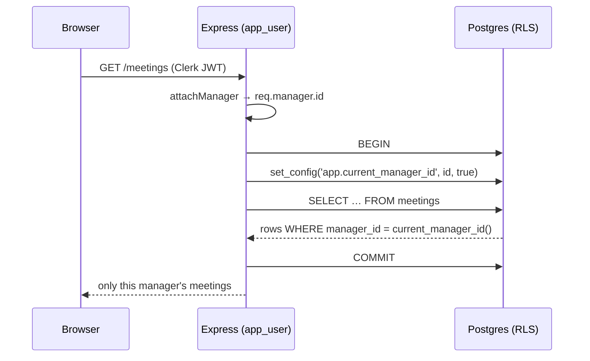

# Security & privacy model

FairHire's central promise is a privacy contract, not a feature:

> **A manager sees only their own interviews and patterns. HR sees only
> anonymised, organisation-level aggregates — never an individual manager's
> data.**

This document explains how that contract is enforced at the database layer (so
it holds even if the application layer has a bug), and how it is *proven* by
tests rather than asserted.

- [Two database clients](#two-database-clients)
- [How a request is scoped: `withManagerContext`](#how-a-request-is-scoped-withmanagercontext)
- [The policy matrix](#the-policy-matrix)
- [Hybrid access: org-readable, owner-writable](#hybrid-access-org-readable-owner-writable)
- [The HR view: why `SECURITY DEFINER` beats plain RLS](#the-hr-view-why-security-definer-beats-plain-rls)
- [How it's proven](#how-its-proven)

---

## Two database clients

All data access goes through one of two Prisma clients, defined in
[`api/src/lib/prisma.ts`](../api/src/lib/prisma.ts):

| Client | Connects as | RLS | Connection string | Used for |
|---|---|---|---|---|
| `prisma` | `app_user` (non-superuser) | **Enforced** | `DATABASE_URL` (pooled) | All normal request handling |
| `systemPrisma` | `postgres` (superuser) | **Bypassed** | `DIRECT_URL` (direct) | A small, enumerated set of context-less paths |

`app_user` is a dedicated least-privilege Postgres role created by
[`prisma/manual/001_rls.sql`](../prisma/manual/001_rls.sql). Row-Level Security
policies apply to it; the superuser bypasses RLS by design.

**`systemPrisma` is a deliberately small, auditable surface.** It is only for
code that runs *before* a manager identity exists or *outside* any authenticated
request. The legitimate call sites are enumerated in a comment at the top of
`prisma.ts`, and the rule for reviewers is explicit: any new `systemPrisma` call
site must be added to that list, so the RLS-bypass surface stays visible in
diffs. The current legitimate uses are:

- **Pre-auth bootstrap** — looking up a `Manager` by Clerk user ID in the auth
  middleware; the first-login `POST /auth/sync` upsert.
- **Context-less paths** — the `POST /internal/analysis/:runId/results` callback
  (secret-authenticated, no Clerk JWT), the background `runAnalysis` job, and its
  best-effort failure marker (which must record a failure even when the failure
  was in the `withManagerContext` path itself).

> A Clerk-authenticated route handler must **never** use `systemPrisma`. It uses
> `withManagerContext(req.manager.id, …)` so RLS enforces ownership.

---

## How a request is scoped: `withManagerContext`

RLS policies key off a Postgres session variable, `app.current_manager_id`. The
helper [`withManagerContext`](../api/src/lib/prisma.ts) opens an interactive
transaction, sets that variable as **transaction-local**, and runs the query
inside it:

```ts
export async function withManagerContext<T>(
  managerId: string,
  fn: (tx: TransactionClient) => Promise<T>,
): Promise<T> {
  return prisma.$transaction(
    async (tx) => {
      await tx.$executeRaw`SELECT set_config('app.current_manager_id', ${managerId}, true)`;
      return fn(tx);
    },
    { timeout: 30_000, maxWait: 10_000 },
  );
}
```

The policies read that variable through a SQL helper defined in `001_rls.sql`:

```sql
CREATE OR REPLACE FUNCTION current_manager_id()
RETURNS text LANGUAGE sql STABLE AS $$
  SELECT NULLIF(current_setting('app.current_manager_id', true), '')
$$;
```

The critical property is the **default**: if the variable was never set,
`current_manager_id()` returns `NULL`, no policy predicate matches, and **every
query returns zero rows**. Forgetting to wrap a query in `withManagerContext`
fails *closed* (empty result), never open (leaked data). A bare `prisma.*` call
with no context returns `[]`.



(The generous 30s timeout is because the database lives in Supabase Tokyo and
deep nested includes plus round-trips overshoot Prisma's 5s default.)

---

## The policy matrix

RLS is enabled on **11 tables**, covered by **29 policies** across
[`prisma/manual/001`–`004`](../prisma/manual/). Every policy is scoped per
command — there are no blanket `FOR ALL` policies — so the exact write surface
is legible:

| Table | SELECT | INSERT | UPDATE | DELETE |
|---|:--:|:--:|:--:|:--:|
| `organisations` | ✓ | | | |
| `departments` | ✓ | | | |
| `managers` | ✓ | ✓ | ✓ | |
| `candidates` | ✓ | ✓ | ✓ | |
| `candidate_demographics` | ✓ | ✓ | ✓ | |
| `meetings` | ✓ | ✓ | ✓ | |
| `meeting_candidates` | ✓ | ✓ | | |
| `decisions` | ✓ | ✓ | ✓ | |
| `flags` | ✓ | ✓ | ✓ | ✓ |
| `flag_spans` | ✓ | ✓ | ✓ | |
| `analysis_runs` | ✓ | ✓ | ✓ | |

The absences are intentional: `organisations`/`departments` are read-only
reference data; most tables have no `DELETE` policy (records are soft-deleted or
cascade); only `flags` allows `DELETE` (the re-run path wipes prior flags before
a fresh analysis). This table is not just documentation — it is an **enforced
contract** (see [How it's proven](#how-its-proven)).

---

## Hybrid access: org-readable, owner-writable

Not every table is scoped the same way. `candidates` is the clearest example of
a deliberate split:

- **SELECT is org-scoped** (`managers_select_org_candidates`): any manager in the
  org can *read* the candidate roster.
- **UPDATE is owner-scoped** (`managers_update_linked_candidates`): a manager can
  only *modify* a candidate they have actually interviewed — i.e. there is a
  `meeting_candidates` row joining that candidate to a meeting they own.

The database-side UPDATE gate mirrors the application-side
`requireOwnership('candidate')` middleware, so the two agree. This is what lets
the candidate list show an org-wide roster while keeping writes owner-bound.

---

## The HR view: why `SECURITY DEFINER` beats plain RLS

The HR Overview needs org-level aggregates (flag rates, decision outcomes,
demographic funnels). Plain RLS can't deliver this without breaking the privacy
contract:

- If HR reads the base tables as `app_user`, the manager-scoped policies return
  **only that HR user's own rows** — aggregates come back as zeros.
- The only way to fix that with plain RLS is to add a **broad org-level SELECT
  policy** to the base tables — which would also expose every individual flag's
  `excerpt`, `reasoning`, and owning `manager_id`. That is exactly the leak the
  product promises not to have.

The four aggregate functions in
[`prisma/manual/005_hr_aggregates.sql`](../prisma/manual/005_hr_aggregates.sql)
resolve this structurally. They are `SECURITY DEFINER`, so the function body runs
as its **owner** (the superuser that created it) and can read across the org to
aggregate — but the function's **return type contains only aggregate columns**:

```sql
CREATE OR REPLACE FUNCTION hr_flag_summary(p_start timestamptz, p_end timestamptz)
RETURNS TABLE(flag_type text, count bigint, dismissed bigint)   -- counts only
LANGUAGE sql STABLE SECURITY DEFINER SET search_path = public AS $$
  SELECT f.flag_type::text, COUNT(*)::bigint,
         COUNT(*) FILTER (WHERE f.dismissed)::bigint
  FROM flags f JOIN meetings m ON m.id = f.meeting_id
  WHERE m.org_id = (SELECT org_id FROM managers WHERE id = current_manager_id())
    AND m.date >= p_start AND m.date <= p_end
  GROUP BY f.flag_type
$$;
```

Two properties make this safe by construction, not by filtering:

1. **No identifiable column exists to leak.** There is no `manager_id`,
   `excerpt`, or `reasoning` in the `RETURNS TABLE(...)` signature, so a
   manager-identifiable row is *unrepresentable*, not merely omitted.
2. **The caller can't choose the org.** The organisation is derived from
   `current_manager_id()` *inside* the function body — it is never a parameter —
   so a caller cannot aggregate a different tenant's data.

The functions:

| Function | Returns |
|---|---|
| `hr_flag_summary(start, end)` | flag type → raised + dismissed counts |
| `hr_decision_summary(start, end)` | decision outcome → count |
| `hr_demographic_summary(start, end)` | race → applied / hired / rejected counts |
| `candidate_flag_counts()` | per candidate → total + own flag counts (org-wide) |

`SECURITY DEFINER` is defence in depth, not the only gate: every `/hr/*` route
also sits behind `requireRole('hr_admin')`, so a regular manager calling the
endpoints directly gets a `403` before any function runs.

> **k-anonymity caveat (by design).** In a sparse org, "flags by others" on a
> candidate, or a single-manager division, can attribute back to one person.
> This is a conscious, documented trade-off surfaced only as counts, never as
> per-manager rows — see the comments in `005_hr_aggregates.sql`.

---

## How it's proven

Mock-based route tests can't catch an RLS gap (they stub Prisma, so the real
session-variable + policy path never runs). Two opt-in integration suites run
against a live RLS-applied database (`INTEGRATION=1`):

- **[`rls.integration.test.ts`](../api/src/__tests__/rls.integration.test.ts)** —
  adversarial isolation. It spins up a **second organisation** and asserts, via
  `withManagerContext`, that one manager cannot see or write another manager's
  rows *or* any second-org rows across meetings/flags/decisions/analysis_runs; a
  no-context client returns `[]`; and the HR functions return only the caller's
  org's aggregates.
- **[`rlsPolicyCoverage.integration.test.ts`](../api/src/__tests__/rlsPolicyCoverage.integration.test.ts)** —
  a coverage matrix. It introspects `pg_tables` + `pg_policies` and asserts every
  protected table has RLS enabled **and exactly** its expected set of policy
  commands. This turns the [policy matrix](#the-policy-matrix) above into an
  enforced contract: a missing or extra policy fails the test in one shot.

```bash
# apply prisma/manual/001–005, then:
INTEGRATION=1 npm test --workspace=api
```

See also **[ARCHITECTURE.md](./ARCHITECTURE.md)** for where these pieces sit in
the system, and **[ANALYSIS.md](./ANALYSIS.md)** for how flags are produced.
